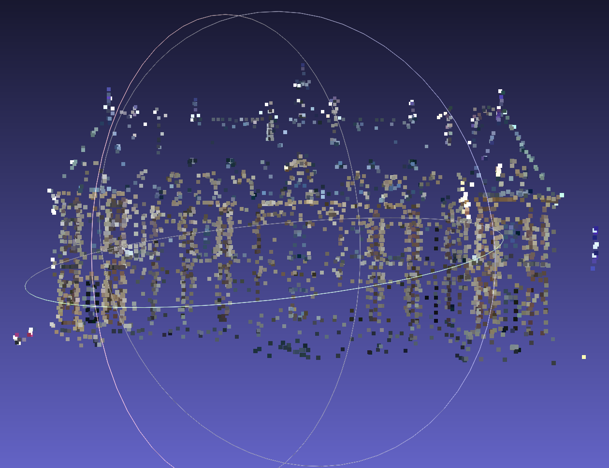

# Running Open MVG
Based on work from [the OpenMVG github](https://github.com/openMVG/openMVG/wiki/OpenMVG-on-your-image-dataset).
## Run the docker container
```
docker build -t open-mvg-image .
docker run -it --name my-openmvg-container open-mvg-image /bin/bash
```
## Run the custom Open MVG script from the docker container 
```
cd working
python3 mvg_script.py
```
## Copy output back to your machine
From the `open_mvg` folder on your machine, run
```
docker cp my-openmvg-container:/working/output .
```
## View with Meshlab
Example of colorized.ply for [the Sceaux Castle dataset](https://github.com/openMVG/ImageDataset_SceauxCastle):
