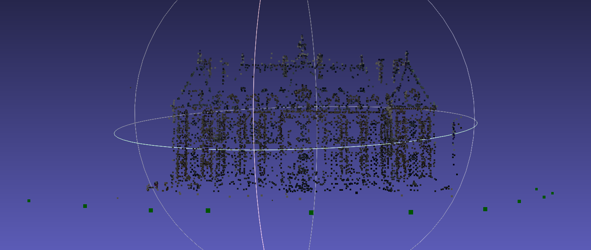

# Phoenix Recon

[Team Wiki Page](https://github.com/cs210/2025-ManageXR-2/wiki/)

[Project Milestones](https://github.com/cs210/2025-ManageXR-2/milestones)

# Running Open MVG
For full instructions, see [the OpenMVG github](https://github.com/openMVG/openMVG/wiki/OpenMVG-on-your-image-dataset).
## Run the docker container
```
cd open-mvg
docker build -t open-mvg-image .
docker run -it --name my-openmvg-container open-mvg-image /bin/bash
```
## Run Open MVG from in the docker container 
```
cd /opt/openMVG_Build/software/SfM/
mkdir output
python3 SfM_SequentialPipeline.py images output
```
## Prepare output for OpenMVS
```
openMVG_main_openMVG2openMVS -i output/reconstruction_sequential/sfm_data.bin -o output/scene.mvs output/scene_undistorted_images/
```
## Copy output back to your machine
From `open-mvg` on your machine, run
```
docker cp my-openmvg-container:/opt/openMVG_Build/software/SfM/output .
```
## View with Meshlab
Example of colorized.ply for the Sceaux Castle dataset:


# Running Open MVS
## Run the docker container
```
cd open-mvs-2/docker
./QUICK_START.sh /path/to/Phoenix-Recon/open-mvg/output 
```
## Run Densify Point Cloud
> **Note:** Does not currently work. Getting an "invalid project" error for scene.mvs.
```
DensifyPointCloud scene.mvs
```
## Run ReconstructMesh
> **Note:** Does not currently work. Getting an "invalid project" error for scene.mvs.
```
ReconstructMesh scene.mvs
```
## Full example error
```
root@9c8a66a0a3f6:/working# DensifyPointCloud scene.mvs
00:04:33 [App     ] Build date: Dec 10 2019, 20:59:37
00:04:33 [App     ] CPU: Intel(R) Xeon(R) CPU E5-2690 v4 @ 2.60GHz (56 cores)
00:04:33 [App     ] RAM: 125.78GB Physical Memory 119.21GB Virtual Memory
00:04:33 [App     ] OS: Linux 5.15.0-130-generic (x86_64)
00:04:33 [App     ] SSE & AVX compatible CPU & OS detected
00:04:33 [App     ] Command line: scene.mvs
00:04:33 [App     ] error: invalid project
```
