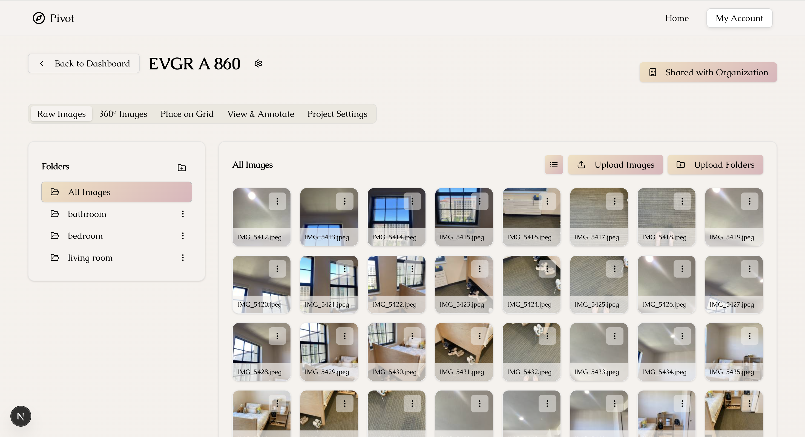
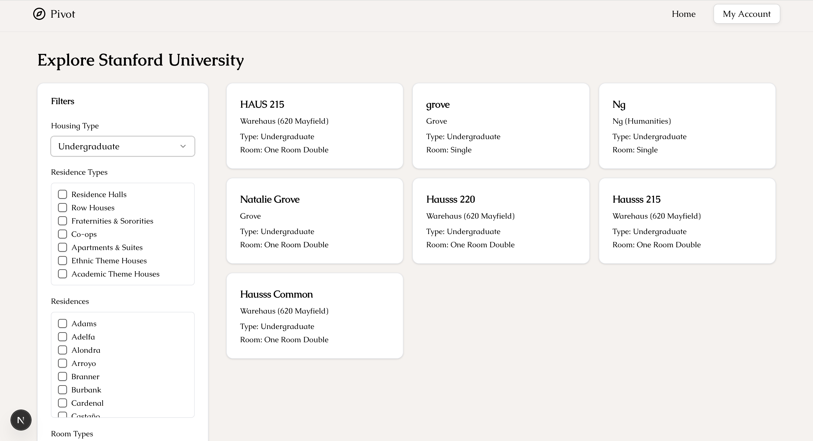

# Pivot

**Mobile-first 360° virtual tour creation using just your phone**

Pivot is a lightweight platform for capturing, generating, and sharing immersive 360° walkthroughs of real estate spaces—no special hardware or technical skills required. Designed with short-term rental hosts, subletters, and real estate agents in mind, Pivot lets users scan their space room-by-room using their smartphone, automatically generate 360° views, and instantly share a complete virtual tour via link.

Unlike traditional solutions like Matterport, Pivot is fast, affordable, and accessible to everyday users.

---

## 🚀 Why Pivot?

### The Problem  
Creating professional virtual tours today is:
- Expensive (e.g. Matterport costs hundreds of dollars per property)
- Equipment-heavy (special cameras or contractors)
- Out of reach for smaller hosts and renters

### Our Solution  
Pivot democratizes tour creation:
- **No hardware** — just your phone. 20–40 images per room.
- **No stitching/editing** — fully automated within minutes
- **No friction** — built-in sharing, mobile/web/VR viewing

---

## 🧪 Demo

<p align="center">
  
</p>

*<p align="center">A sample walkthrough generated entirely using Pivot’s guided photo capture and auto-stitch pipeline. GIF compressed due to Github size constraints. </p>*

---

## 🔍 Key Features

<div style="display: flex; justify-content: center; gap: 40px; flex-wrap: wrap; align-items: flex-start;">

  <div style="text-align: center;">
    
    <div><em>Project Page: Upload & organize photos, stitch 360° images, arrange room layout, annotate, and manage project settings</em></div>
  </div>

  <div style="text-align: center;">
    
    <div><em>Explore Page: Discover tours in your organization (e.g., Stanford dorm rooms for housing discovery)</em></div>
  </div>

</div>

<br>

- **Project & Room Setup** – Create structured projects and define rooms before capture  
- **Guided Photo Capture** – Step-by-step camera guidance to generate smooth 360° coverage  
- **Existing Photo Upload** – Use pre-existing 360°/panoramic images if preferred  
- **Auto Tour Generation** – Automatically connects rooms into a seamless, navigable tour  
- **360 Viewer** – Intuitive mobile + web viewer with pan, zoom, and room transitions  
- **Shareable Link & Embed** – Instantly share via link or embed in listings. Also share with users from your organization (e.g., @stanford.edu)
- **Room Rearrangement Tool** – Drag-and-drop rooms into a visual floorplan  
- **Room Labeling** – Custom names for each room (e.g., "Primary Bedroom")  
- **Tour Privacy Settings** – Public, private, or password-protected viewing options  
- **Annotations** – Highlight key features (e.g., dishwasher, balcony) with labels/icons  

---

## 🛠️ Tech Stack

- **Frontend (Web):** React + TypeScript
- **Mobile App:** React Native
- **Backend:** Supabase (RLS-secured), PostgreSQL
- **Image Processing:** AWS + PTGui CLI (stitching 20–40 smartphone photos into 360° images in minutes)
- **Authentication & Sharing:** Supabase Auth + storage rules to support:
  - Public links
  - Org-only access (e.g., `@stanford.edu`)
  - Private/internal tours

---

## 🎮 VR Viewer

This folder contains the Unity project that allows users to experience a 360° walkthrough of their space in virtual reality.

---

## 📊 Competitive Snapshot

|                    | **Pivot** | **Matterport** |
|--------------------|-----------|----------------|
| Hardware Required  | No        | Yes            |
| Cost               | Free      | $$$ per tour   |
| Time to Publish    | Minutes   | Hours/days     |
| Skill Required     | None      | Moderate       |
| Shareability       | Web, mobile, VR | Web, mobile, VR |
| Ideal For          | Small hosts, renters, student housing | Enterprise, realtors |

Pivot isn’t trying to replace Matterport for luxury listings—it’s unlocking virtual tours for the 90% of the market they can’t serve.

---

## 🎓 Project Info

This prototype was developed as part of a Stanford CS210 senior project.

**Contributors:**
- [Caroline Cahilly](https://github.com/ccahilly)  
- [Miro Swisher](https://github.com/MiroSwisher)  
- [Michael Souliman](https://github.com/michaelsouliman)  
- [Jun Yang Ang](https://github.com/theviciouscircle)  
- [Majd Nasra](https://github.com/majdnasra2)

**Special thanks** to our TA [Natalie Greenfield](https://github.com/natalieg1) and instructor [Jay Borenstein](https://github.com/JBB)

---

## 📁 Repo Structure

```bash
.
├── README.md             # Project overview and media
├── archive/              # Legacy or in-progress code
├── img/                  # Media assets for README
├── mobile_app/           # React Native capture app
├── vr_viewer/            # Unity-based VR walkthrough viewer
└── webapp/               # Web-based project/tour management interface

## 📎 Additional Resources

- 📘 [Team Wiki Page](https://github.com/cs210/Pivot/wiki)  
- 📐 [Team Coding Standards](https://github.com/cs210/Pivot/wiki/Team-Coding-Standards)  
- 📄 [Product Requirements Document](https://docs.google.com/document/d/1jG3TpzOdq8mq9hlyTwwn-EBwxiXAfL_b9FL28QPo6WE/edit?tab=t.0#heading=h.p6o1yo1yd1du)