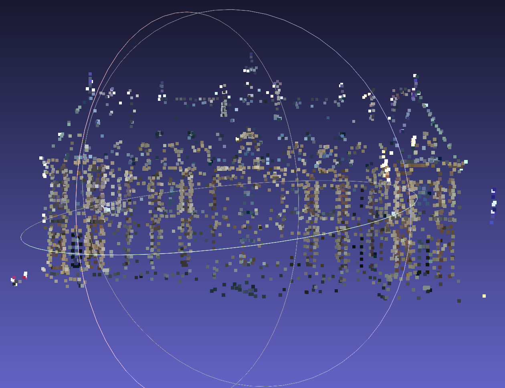

# Phoenix Recon

[Team Wiki Page](https://github.com/cs210/2025-ManageXR-2/wiki/)

[Project Milestones](https://github.com/cs210/2025-ManageXR-2/milestones)

# Running Open MVG
For full instructions, see [the OpenMVG github](https://github.com/openMVG/openMVG/wiki/OpenMVG-on-your-image-dataset).
## Run the docker container
```
cd open-mvg
docker build -t open-mvg-image .
docker run -it --name my-openmvg-container open-mvg-image /bin/bash
```
## Run Open MVG from in the docker container 
```
cd /opt/openMVG_Build/software/SfM/
mkdir output
python3 SfM_SequentialPipeline.py images output
```
## Copy output back to your machine
From `open-mvg` on your machine, run
```
cp my-openmvg-container:/opt/openMVG_Build/software/SfM/output .
```
## Open with Meshlab
Example of colorized.ply for the Sceaux Castle dataset:

#